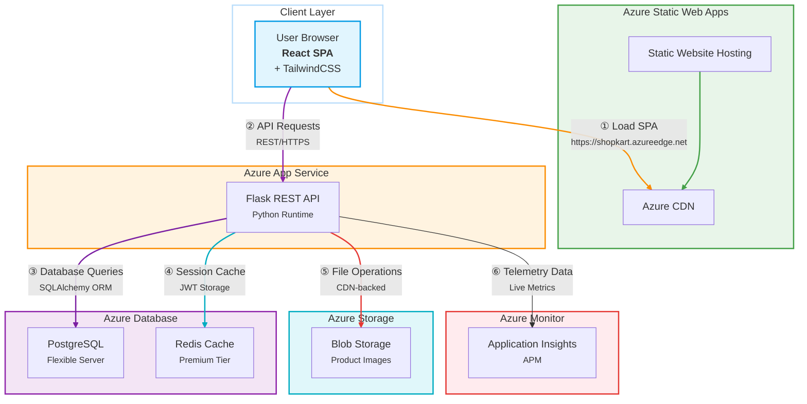

# High-Level Architecture Design

This document gives a detailed overview of the Shop Kart solution’s architecture, the technologies chosen for each layer, and how the pieces fit together.

---

## 1. System Overview

The Shop Kart platform is a classic “Single-Page Application + REST API + Database” stack, deployed end-to-end on Azure:

# ShopKart Azure Architecture

## 2. Component Breakdown

### 2.1 Frontend (Client)

* **Tech**: React, Tailwind CSS, React Query
* **Responsibilities**:
    * Render product catalog, search/filter UI, cart & checkout flows
    * Manage client-side cache, optimistic updates over React Query
    * Handle authentication tokens (JWT) in localStorage
* **Deployment**:
    * Built into static assets (`npm run build`)
    * Hosted on Azure Storage static website
    * Served via Azure CDN for low-latency global distribution

### 2.2 API Layer (Compute)

* **Tech**: Python, Flask, Flask-RESTful, Flask-CORS, Flask-JWT-Extended, SQLAlchemy ORM, Alembic migrations
* **Responsibilities**:
    * Expose `/api/*` endpoints for products, cart, orders, reviews, auth
    * Business logic: inventory control, order processing, role-based access (admin vs. user)
    * Input validation, error handling, pagination, search/filter semantics
* **Deployment**:
    * Packaged into a Docker image or directly deployed via Azure App Service (Linux)
    * Environment variables for `DATABASE_URL`, `JWT_SECRET` stored in Azure App Settings

### 2.3 Data Storage

* **Relational DB**: Azure Database for PostgreSQL
    * Stores users, products, cart items, orders, reviews
    * Ensures ACID transactions for cart ↔ order consistency
* **Cache**: Azure Cache for Redis
    * Caches hot product listings, session data, rate-limit counters

### 2.4 Blob Storage

* **Tech**: Azure Blob Storage
* **Responsibilities**:
    * Store and serve product images
    * Frontend references image URLs via CDN or direct SAS URLs

### 2.5 Authentication & Security

* JWT via Flask-JWT-Extended
    * Short-lived access tokens, stored in client localStorage
    * `@jwt_required()` decorators secure protected endpoints
    * Role Checks (“admin” flag) enforce access to admin routes

### 2.6 Monitoring & Observability

* Azure Application Insights
    * Captures request/response times, exceptions, custom events (`add_to_cart`, `order_created`)
    * Live metrics stream and custom dashboards

## 3. Data Flow

* **SPA Bootstrapping**
    * Browser requests `index.html` from Azure CDN → Azure Storage
    * React bundle downloads, hydrating client application
* **Product & Cart Operations**
    * Client calls `/api/products?page=…&search=…` → Flask API
    * Flask queries PostgreSQL (with Redis caching layer)
    * Results returned as JSON; React Query caches responses
* **Authentication**
    * Login → POST `/api/auth/login` → returns JWT
    * Subsequent calls include `Authorization: Bearer <token>`
* **Order Processing**
    * Cart → POST `/api/cart/add` decrements stock, caches cart
    * Checkout → POST `/api/orders/checkout` creates Order + OrderItems, clears cart
* **Telemetry**
    * Each API call and key business event logged to App Insights

## 4. Why These Technologies?

| Layer            | Choice                           | Rationale                                                                                             |
| ---------------- | -------------------------------- | ----------------------------------------------------------------------------------------------------- |
| Frontend         | React + Tailwind + React Query     | Rapid SPA development, utility-first CSS, client caching                                                |
| Static Hosting   | Azure Storage + CDN                | Cost-effective, high throughput for static assets                                                     |
| API              | Flask + SQLAlchemy                 | Lightweight Python microframework, rich ORM & migration tool                                          |
| Database         | PostgreSQL                       | Mature, ACID-compliant, sized for growth                                                              |
| Cache            | Redis                            | Blazingly fast, supports counters & pub/sub if needed                                                  |
| Blob Storage     | Azure Blob                         | Scalable object store, integrates with Azure CDN                                                        |
| Auth & Monitoring | JWT + App Insights               | Stateless auth, end-to-end telemetry in one Azure ecosystem                                           |

This architecture balances development speed, operational simplicity, and enterprise-grade scalability.
